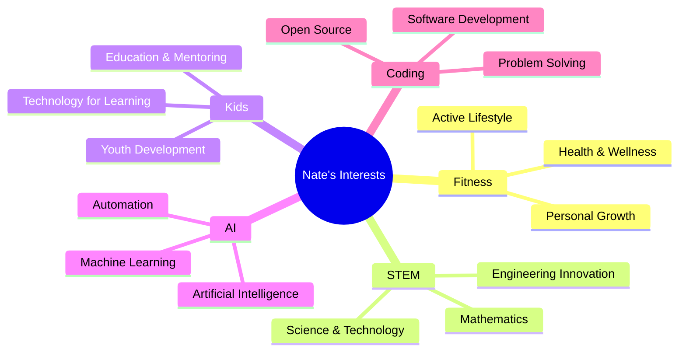

# Nate Swenson
### Cloud and DevOps Professional | AWS Solutions Architect | Terraform and Container Expert

---

## 👋 About Me

I'm **Nate J. Swenson**, a results-driven professional specializing in Cloud and AWS with a strong focus on DevOps practices. With a solid background in software development and infrastructure management, I excel in leveraging cloud technologies to optimize system performance, scalability, and reliability.

Throughout my career, I have successfully designed and implemented cloud-based solutions on AWS, utilizing services such as EC2, S3, Lambda, EKS, ECS, and CloudFormation. I am highly skilled in infrastructure-as-code (IaC) principles and have extensive experience with Terraform, enabling streamlined provisioning and automation of cloud resources.

Furthermore, I have expertise in deploying and managing applications in containerized environments using Kubernetes on AWS EKS. I have worked with Docker extensively, ensuring efficient container orchestration and seamless application deployment. Most recently leveraging ArgoCD to manage EKS deployments.

My proficiency extends to monitoring and troubleshooting cloud environments using AWS CloudWatch and other monitoring tools such as DataDog to ensure high availability and optimal performance. I am also skilled in implementing security best practices and maintaining compliance in AWS environments.

As a motivated professional, I thrive in collaborative environments, working closely with cross-functional teams to drive successful cloud deployments and DevOps practices. I am constantly seeking opportunities to enhance my skills and stay abreast of the latest advancements in cloud technologies.

## 🛠️ Technical Expertise

### Core Competencies

| **🚀 DevOps & Cloud** | **Skill Level** | **💻 Development** | **Skill Level** |
|:---|:---:|:---|:---:|
| AWS | `█████████░` 9/10 | Python | `████████░░` 8/10 |
| Terraform | `████████░░` 8/10 | JavaScript | `███████░░░` 7/10 |
| Datadog | `████████░░` 8/10 | Shell | `█████████░` 9/10 |
| Containers | `████████░░` 8/10 | TDD | `████████░░` 8/10 |
| EKS/Kubernetes | `███████░░░` 7/10 | Git | `█████████░` 9/10 |

| **🤖 AI & Automation** | **Skill Level** | **⚙️ Operations** | **Skill Level** |
|:---|:---:|:---|:---:|
| Agentic Workflows | `██████░░░░` 6/10 | Monitoring | `████████░░` 8/10 |
| Claude Code | `███████░░░` 7/10 | CI/CD | `████████░░` 8/10 |
| Cursor | `███████░░░` 7/10 | Infrastructure | `█████████░` 9/10 |
| Chatbots | `██████░░░░` 6/10 | Performance | `███████░░░` 7/10 |
| AWS Bedrock | `█████░░░░░` 5/10 | Security | `███████░░░` 7/10 |

## 💼 Professional Experience

### Current Role at GoodLeap (Remote)
> *Driving innovation in sustainable energy financing through cloud-first solutions*

- ☁️ **Cloud Architecture:** Designing and implementing scalable AWS solutions
- 🏆 **Innovation Recognition:** Arch Forward Award - Hackathon (Nov 2024) for innovative architecture solutions
- 🚀 **DevOps Leadership:** Leading cross-functional teams in cloud deployments and automation practices

## 📊 GitHub Contributions Graph

## 🌍 Impact & Community

### 🌞 GivePower - Volunteer
> *Bringing sustainable energy to underserved communities worldwide*

- **Mission:** Installing solar power systems in remote villages
- **Impact:** Providing clean, reliable electricity to communities without grid access
- **Technology:** Leveraging renewable energy solutions for humanitarian aid
- **Commitment:** Dedicated to using technology for positive global impact

## 🤖 Passion Areas & Interests

- **💪 Fitness:** Committed to health and wellness through active lifestyle and personal growth
- **🔬 STEM:** Passionate about science, technology, engineering, and mathematics innovation
- **👶 Kids:** Dedicated to youth development, education, and creating technology that benefits learning
- **🤖 AI:** Exploring artificial intelligence, machine learning, and intelligent automation solutions
- **💻 Coding:** Enthusiastic about software development, open source contributions, and creative problem solving

## 📫 Let's Connect & Collaborate

### 🤝 I'm always excited to collaborate on projects involving:
**Cloud Computing** • **AI/ML Applications**

 

---

*"Technology should be a force for good - let's build solutions that make a difference."*

