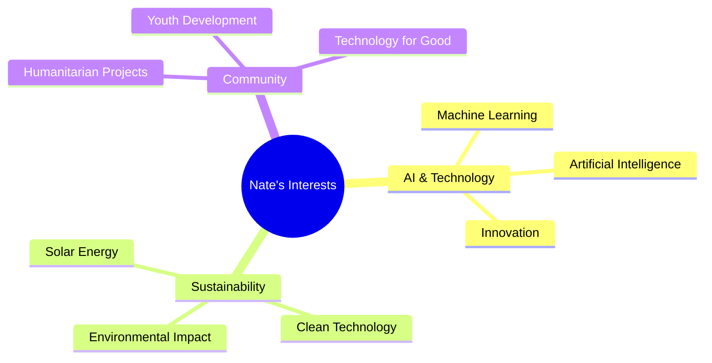

# Nate Swenson
### Cloud and DevOps Professional | AWS Solutions Architect | Terraform and Container Expert

---

## 👋 About Me

I'm **Nate J. Swenson**, a results-driven professional specializing in Cloud and AWS with a strong focus on DevOps practices. With a solid background in software development and infrastructure management, I excel in leveraging cloud technologies to optimize system performance, scalability, and reliability.

Throughout my career, I have successfully designed and implemented cloud-based solutions on AWS, utilizing services such as EC2, S3, Lambda, EKS, ECS, and CloudFormation. I am highly skilled in infrastructure-as-code (IaC) principles and have extensive experience with Terraform, enabling streamlined provisioning and automation of cloud resources.

Furthermore, I have expertise in deploying and managing applications in containerized environments using Kubernetes on AWS EKS. I have worked with Docker extensively, ensuring efficient container orchestration and seamless application deployment. Most recently leveraging ArgoCD to manage EKS deployments.

My proficiency extends to monitoring and troubleshooting cloud environments using AWS CloudWatch and other monitoring tools such as DataDog to ensure high availability and optimal performance. I am also skilled in implementing security best practices and maintaining compliance in AWS environments.

As a motivated professional, I thrive in collaborative environments, working closely with cross-functional teams to drive successful cloud deployments and DevOps practices. I am constantly seeking opportunities to enhance my skills and stay abreast of the latest advancements in cloud technologies.

## 🛠️ Technical Expertise

### Core Competencies

**🚀 DevOps Engineering**
- Continuous Integration/Continuous Deployment (CI/CD) pipeline design and implementation
- Infrastructure automation and orchestration
- Configuration management and version control systems
- Monitoring, observability, and intelligent automation solutions

**💻 Development & Programming**
- Software engineering with cloud-native programming practices
- Test-Driven Development (TDD) and automated testing frameworks
- Microservices architecture and API development
- Code quality, security, and performance optimization

**⚙️ Operations & Infrastructure**
- Infrastructure as Code (IaC) with Terraform and CloudFormation
- Container orchestration using Kubernetes and Docker
- System monitoring, troubleshooting, and performance tuning
- High availability, scalability, and disaster recovery planning

**🤖 AI & Agentic Automation**
- Artificial Intelligence and Machine Learning integration
- Intelligent automation and agentic workflow design
- AI-driven monitoring and self-healing infrastructure
- Automated decision-making systems and smart operations

## 💼 Professional Experience

### Current Role at GoodLeap (Remote)
> *Driving innovation in sustainable energy financing through cloud-first solutions*

- ☁️ **Cloud Architecture:** Designing and implementing scalable AWS solutions
- 🏆 **Innovation Recognition:** Arch Forward Award - Hackathon (Nov 2024) for innovative architecture solutions
- 🚀 **DevOps Leadership:** Leading cross-functional teams in cloud deployments and automation practices

## 📊 GitHub Activity

## 🚀 Featured Projects

*🔧 Curating a showcase of innovative projects and solutions - Stay tuned!*

*Projects will highlight cloud architecture, AI implementations, and humanitarian technology applications*

## 🌍 Impact & Community

### 🌞 GivePower - Solar Energy Volunteer
> *Bringing sustainable energy to underserved communities worldwide*

- **Mission:** Installing solar power systems in remote villages
- **Impact:** Providing clean, reliable electricity to communities without grid access
- **Technology:** Leveraging renewable energy solutions for humanitarian aid

### 👨‍🏫 Youth Development & Coaching
> *Investing in the next generation through mentorship and guidance*

- **Community Leadership:** Active in local youth coaching programs
- **Mentorship:** Sharing technology and professional development insights
- **Impact:** Helping young people develop leadership and technical skills

## 🌐 Languages & Communication

| Language | Proficiency | Context |
|----------|-------------|---------|
| 🇺🇸 **English** | Native | Professional & Personal |
| 🇪🇸 **Spanish** | Elementary | Travel & Cultural Exchange |
| 🤟 **American Sign Language (ASL)** | Limited Working | Accessibility & Inclusion |

## 🎓 Educational Foundation

**University of Minnesota-Duluth** | *2005-2010*
- Strong foundation in analytical thinking and problem-solving
- Developed leadership and teamwork skills through diverse coursework

## 🤖 Passion Areas & Interests

- **🤖 AI & Machine Learning:** Exploring applications of artificial intelligence in solving real-world problems
- **🌱 Sustainable Technology:** Passionate about using technology to address climate challenges
- **🌍 Humanitarian Tech:** Developing solutions that improve lives in underserved communities
- **⚡ Clean Energy:** Supporting the transition to renewable energy through technology innovation

## 📫 Let's Connect & Collaborate

### 🤝 I'm always excited to collaborate on projects involving:
**Cloud Computing** • **AI/ML Applications** • **Humanitarian Technology** • **Sustainable Energy Solutions**

 

---

*"Technology should be a force for good - let's build solutions that make a difference."*

